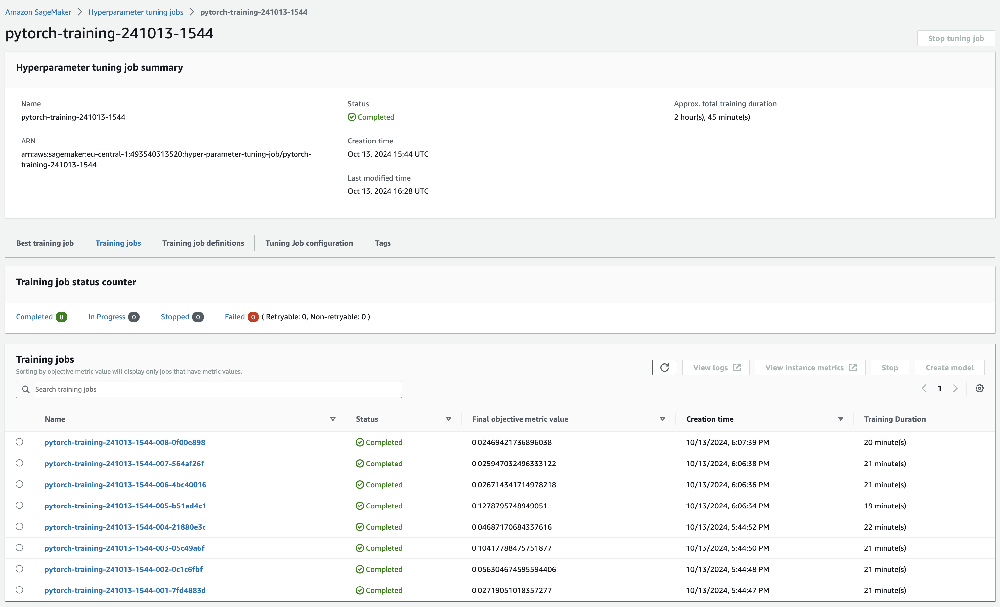
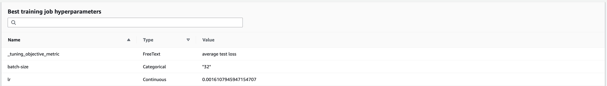
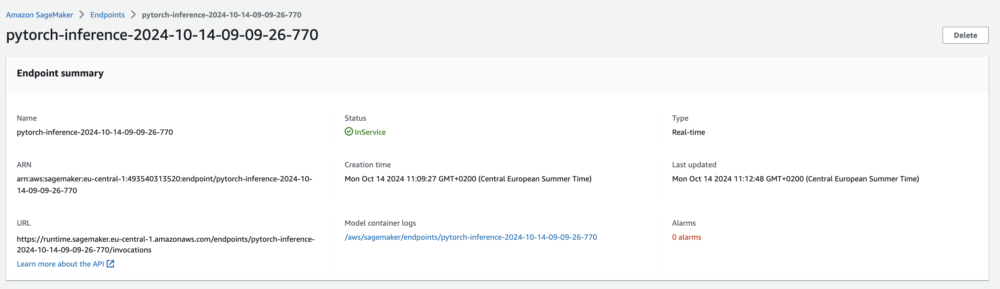
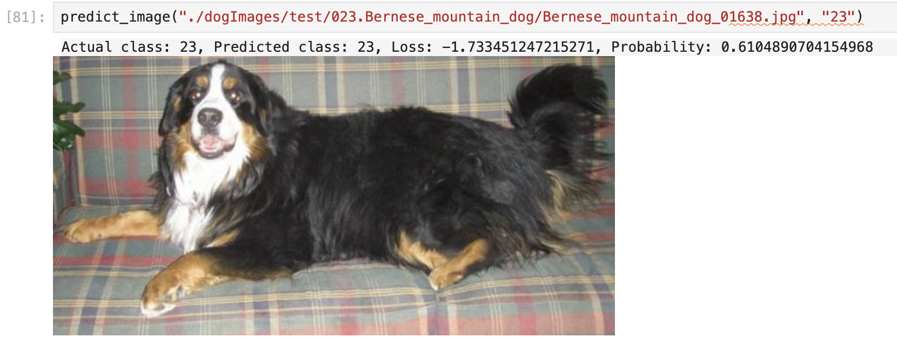
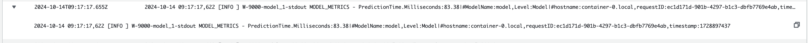

# Dog breed image classification using AWS SageMaker

Fine-tuning of a ResNet-50 CNN to predict the breed of a dog based on an image from the dog. 
The focus is less on the model itself but rather how to fine-tune and perform hyperparameter optimization with AWS SageMaker.

## Files

* `train_model.py` is for the training job which demonstrates use of SageMaker Profiler and Debugger
* `hpo.py` is for the training job which demonstrates how to perform hyperparameter optimization
* `inference.py` is the code required by the endpoint for on-demand inference. It sets up the model with the fine-tuned weights and performs perparation of inference input.
* `train_and_deploy.ipynb` is the notebook used to prepare data, trigger training jobs and deploy the endpoint

## Dataset

The dataset provided by Udacity has images for 133 different breeds.

## Hyperparameter Tuning

Hyperparameter optimizaiton was done for the `learning rate` and `batch size` with the followint values

```
hyperparameter_ranges = {
    'lr': ContinuousParameter(0.001,0.01),
    'batch-size': CategoricalParameter([16, 32, 48])
}
```

8 combinations were tested 



and the best one was




## Debugging and Profiling

I configured these built-in rules for debugging my model
```
rules = [
    Rule.sagemaker(rule_configs.loss_not_decreasing()),  
    Rule.sagemaker(rule_configs.vanishing_gradient()),
    Rule.sagemaker(rule_configs.overfit()),
    Rule.sagemaker(rule_configs.overtraining()),
    Rule.sagemaker(rule_configs.poor_weight_initialization()),
    ProfilerRule.sagemaker(rule_configs.LowGPUUtilization()),
    ProfilerRule.sagemaker(rule_configs.ProfilerReport()) 
]
```

With the help of that output it was visible that training should have stopped earlier


### Results
Link to [SageMaker Debugger Profiling Report](ProfilerReport/profiler-output/profiler-report.html)

## Model Deployment

For model deployment the functions 

* `model_fn`: Specifies the same network architecture as used during training and then loads the weights with `model.load_state_dict()`
* `input_fn`: Performs same input processing (resize, crop, scaling, normalization) as during testing and valication
* `predict_fn`: Passes the output of `input_fn` to the model.

were defined in the entry point `inference.py` 



With the helper function which converted the loss response to a probability the endpoint was queried



Prediction time was around ~ 100ms


